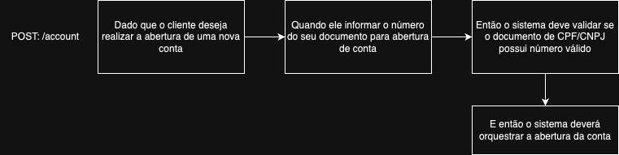
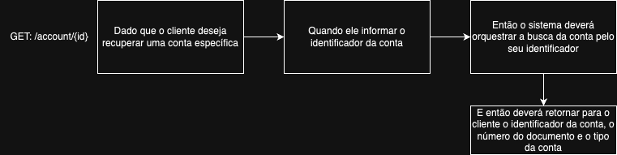
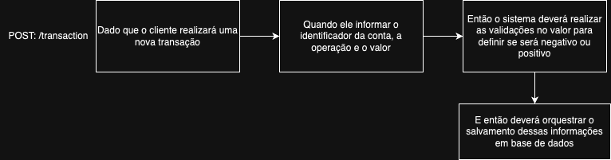

# MS Transaction Control

This project is a Java solution that runs in a Docker environment with a Dockerfile and a docker-compose.

## Negotial Requirements

```text
1. Each client has an account with their data.
2. Each operation performed by the customer generates a new transaction associated with his account.
3. Each operation has a type (cash purchase, partial purchase, withdraw or payment), a value and a creation date;
4. Transactions like buying and withdrawing will be saved with a negative amount;
5. Transactions like payment will be saved with a positive amount.
```

## Features on BDD

This is the fluxogram for the POST-account, GET-account and POST-transaction features:

<div align="center">
    
    <p>BDD to POST-account</p>
</div>

<div align="center">
    
    <p>BDD to GET-account</p>
</div>

<div align="center">
    
    <p>BDD to POST-transaction</p>
</div>

[POST-account](./doc/post-account.png)
[GET-account](./doc/get-account.png)
[POST-transaction](./doc/post-transaction.png)

## Running

To run this project you will need a Docker environment in your machine. If you have this, trying this in your terminal:

```bash
cd IdeaProjects/mstranscationcontrol
```

```bash
cd IdeaProjects/mstranscationcontrol
```

```bash
docker-compose build
```

```bash
docker-compose up
```

## To send application requests

In the paste `collection` you'll find a Postman collection. You can import this in your Postman and send some requests after start the application with command `docker-compose up`.

## To do

```text
1. More unit and integrated tests;
2. Reorganize the Docker files;
3. Build a Exception handler;
4. Validate the document number;
5. Define if document number is a CPF or a CNPJ;
6. Define if Account type is of a PF or PJ;
7. Adding exception threatments on domain classes;
8. Build a feature to dont show the document_number in logs;
```